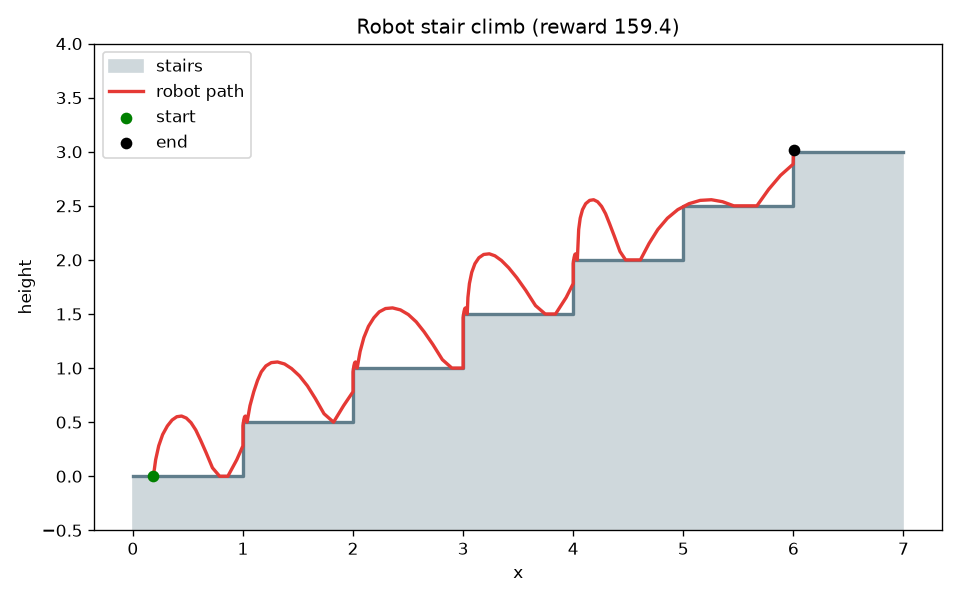

# Robot Stairs RL Sim

A small, self-contained reinforcement-learning project: a 2D robot learns to
**climb a staircase** from scratch using tabular Q-learning. No heavy physics
engines or deep-learning frameworks — just `numpy` (and `matplotlib` for the
optional plots), so it trains in seconds on a laptop.



*The red line is the path of a trained agent: it learns a hopping gait — one
ballistic arc per stair — to climb to the top platform.*

## 🌐 Live web demo

There's a zero-install browser version in [`docs/`](docs/) — the environment and
the Q-learning agent are ported to JavaScript, so the robot **trains and runs
live in your browser** on a canvas (no backend). Hit *Train* and watch it go
from random flailing to a clean hopping gait, with a live learning curve.

> **Live URL (once Pages is enabled):**
> https://pareenvatani23.github.io/improved-octo-parakeet/

There are two browser demos, both with a live "robot's thoughts" narration panel:

- **Stairs climb** (home page) — a 2D robot learns a hopping gait to climb stairs.
- **3D maze escape** — [`docs/maze.html`](docs/maze.html) — a robot learns to escape a
  multi-floor maze, rendered with a self-contained isometric 3D view. Random
  wandering almost never escapes; a trained agent escapes every time via the
  shortest route.

Run it locally with any static server:

```bash
python -m http.server -d docs 8000   # then open http://localhost:8000
```

## The idea

The robot is a point body with position `(x, y)` and velocity `(vx, vy)` in a
vertical plane. The world is a staircase leading up to a goal platform. Simple
physics governs the body:

- **Gravity** pulls it down every tick.
- **Pushing right** accelerates it (with much weaker control while airborne, so
  it must build a run-up *before* leaving the ground).
- **Jumping** is only possible from the ground.
- The vertical face (**riser**) of each step is solid — to advance, the robot's
  feet must clear the next step's height, otherwise it bumps into the wall.
- A **stamina budget** drains with every jump and every push. Run out before
  reaching the top and the robot collapses (episode fails).

These rules make the task non-trivial: flailing randomly only reaches the top
**~55%** of the time, while a trained agent reaches it **~100%** of the time.
The agent has to learn to approach each riser with momentum and time its jump.

### Actions

| # | Name        | Effect                         |
|---|-------------|--------------------------------|
| 0 | `IDLE`      | do nothing                     |
| 1 | `WALK`      | push right                     |
| 2 | `JUMP`      | jump straight up               |
| 3 | `JUMP_RIGHT`| push right **and** jump (climb)|

### Observation

Expressed *relative to the current step* so a single compact policy generalises
across every stair:

```
[x_in_step, height_above_step, vx, vy, on_ground, energy_fraction]
```

### Reward

Per-stair climb bonus + small reward for rightward progress − a per-tick time
penalty, a big bonus for reaching the top, and a penalty for collapsing.

## Layout

```
robot_stairs/
  env.py        StairClimbEnv      -- gym-style environment + physics
  agent.py      TabularQLearner    -- Q-learning with state discretisation
  train.py      training loop + learning-curve plot
  evaluate.py   greedy rollout, ASCII animation, trajectory plot
  render.py     ASCII view + matplotlib plotting
tests/
  test_env.py   physics + learning sanity tests
```

## Quick start

```bash
pip install -r requirements.txt

# train (saves qtable.npy; --plot writes learning_curve.png)
python -m robot_stairs.train --episodes 5000 --plot

# evaluate the trained policy + save a trajectory image
python -m robot_stairs.evaluate --qtable qtable.npy --plot trajectory.png

# watch it climb live in the terminal (ASCII animation)
python -m robot_stairs.evaluate --qtable qtable.npy --render
```

Run the tests with:

```bash
python -m pytest tests/
```

## Using it as a library

```python
from robot_stairs import StairClimbEnv, TabularQLearner

env = StairClimbEnv()
agent = TabularQLearner(n_actions=env.n_actions)

obs = env.reset()
done = False
while not done:
    action = agent.act(obs)
    next_obs, reward, done, info = env.step(action)
    agent.update(obs, action, reward, next_obs, done)
    obs = next_obs
```

The environment is fully parameterised — change the staircase or the physics by
passing keyword arguments, e.g. `StairClimbEnv(num_steps=10, step_height=0.4)`.
